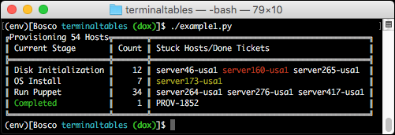

.. _doubletable:

===========
DoubleTable
===========

DoubleTable uses `box drawing characters`_ for table borders. On Windows terminaltables uses `code page 437`_
characters. However there is no equivalent character set for POSIX (Linux/OS X). Python automatically converts CP437
double-line box characters to Unicode and displays that instead.

Gaps on Windows 10
==================

Like SingleTable the console on Windows 10 changed the default font face to ``Consolas``. This new font seems to show
gaps between lines. Switching the font back to ``Lucida Console`` eliminates the gaps.

Gaps on POSIX
=============

There is no easy trick for POSIX like there is on Windows. I can't seem to find out how to force terminals to eliminate
gaps vertically between Unicode characters.

API
===

.. autoclass:: terminaltables.DoubleTable
    :members: column_max_width, column_widths, ok, table_width, table

.. _box drawing characters: https://en.wikipedia.org/wiki/Box-drawing_character
.. _code page 437: https://en.wikipedia.org/wiki/Code_page_437
