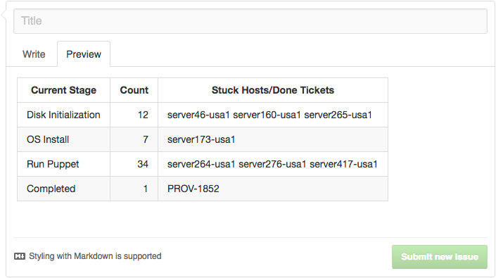

.. _githubtable:

===========================
GithubFlavoredMarkdownTable
===========================

GithubFlavoredMarkdownTable was initially implemented bcho_. It produces a `GitHub Flavored Markdown`_ formatted table.

Because there are no outer table borders:

* Table titles are ignored.
* Border display toggles are also ignored.

.. image:: githubtable.png
    :target: _images/githubtable.png

API
===

.. autoclass:: terminaltables.GithubFlavoredMarkdownTable
    :members: column_max_width, column_widths, ok, table_width, table

.. _bcho: https://github.com/Robpol86/terminaltables/pull/12
.. _GitHub Flavored Markdown: https://help.github.com/categories/writing-on-github
